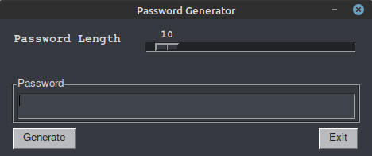
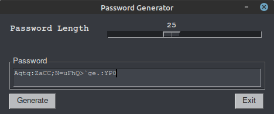
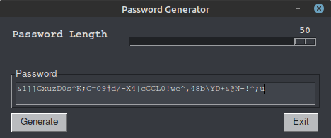

# PyPassword

PyPassword is a simple follow up to PyPassphrase.  After finishing that project it occured to me that while some may wish to use that option, may not be able to do so due to pre-defined password requirements (for example, spaces not allowed or an arbitrary limit on the number of characters).  Therefore, it seemed reasonable to create a more traditional password generator but wrap it also in a GUI frontend with [PySimpleGUI](https://pysimplegui.readthedocs.io/en/latest/).

There is nothing particularly special about this application past its compliment to PyPassphrase.  In fact, I will likely merge the two applications so that both options exist in one.

Stay Tuned!

In the meantime, if you choose to use this as a stand-alone password generator keep in mind no attempts are made to make the resulting passwords easier to remember and it is highly recommended that you use a trusted and secure password manager such as [Keepass](https://keepass.info/) or [Linux Pass](https://www.passwordstore.org/) to store and manage the passwords.

The passwords are generated using the Python [string](https://docs.python.org/3/library/string.html) library using lowercase, uppercase, digits and punctuation characters.  Which group is used is chosen at random using the Python [secrets](https://docs.python.org/3/library/secrets.html) library. A loop is used to randomize the list of characters and then from that list a random sample is taken that is the length of the password specified.

The result is some truly cyrptic passwords that, if using sufficient length (generally 15 characters or more), will be strong enough for most applications.

Currently only the command line option exists to launch the application and that for only Linux at the moment.  To use the application simply download the binary and from the location where it is saved launch a terminal session and run the command `./pypassword`.  This will launch the GUI frontend.

# Screenshots

